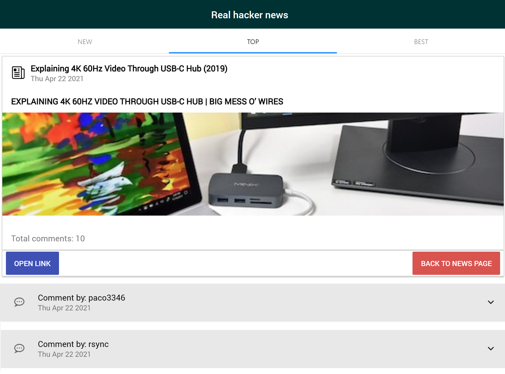
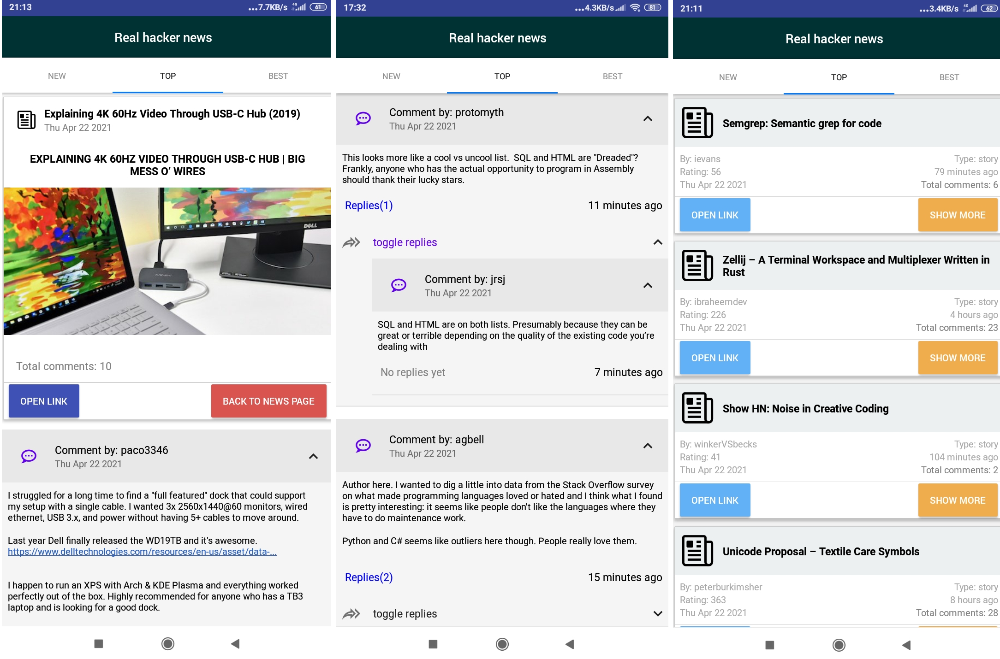
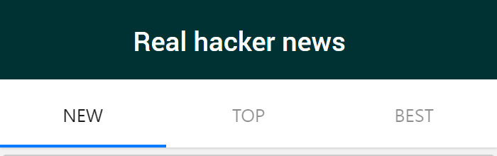
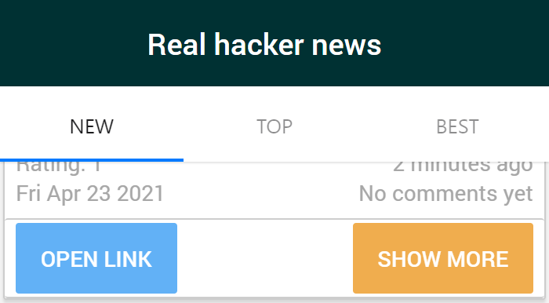

# 🐱‍👤 Real hacker news app 📰

## About

Full usable news application (client) built with React Native for keeping in
touch with hacker news  
 **available on Web💻 & iOS🍏 & Android📱**

## Screenshot
* **browser**

* **iOS**

* **Android**

## Demo

You can try it with GitHub-Pages
[here](https://foxcaulfield.github.io/real-hacker-news-app/)

You can also check out the project page on [EXPO](https://expo.io/@foxcaulfield/projects/real-hacker-news-app)
 
 Note: you can just scan QR at the [EXPO](https://expo.io/@foxcaulfield/projects/real-hacker-news-app) page or right here below 😎
 

## Technologies, libraries & services

Built with:

- react-native
- expo
- react-navigation
- native-base
- react-native-paper
- react-native-render-html
- axios
- microlink
- hacker news API

## Features

- Infinite news and comments scroll with lazy loading
- Replies tree in comments
- Preview with links
- Real time updating

## How to use

- Navigate between New, Top and Best news by tapping or swiping
  

- Move to complete information and comments by tapping "Show more"
  

- Toggle answers and replies  
  

- Tap "Open link" to open source link in browser, tap "Back to news page" for
  step down to news scrolling  
   

Happy hacking!🐱‍👤
